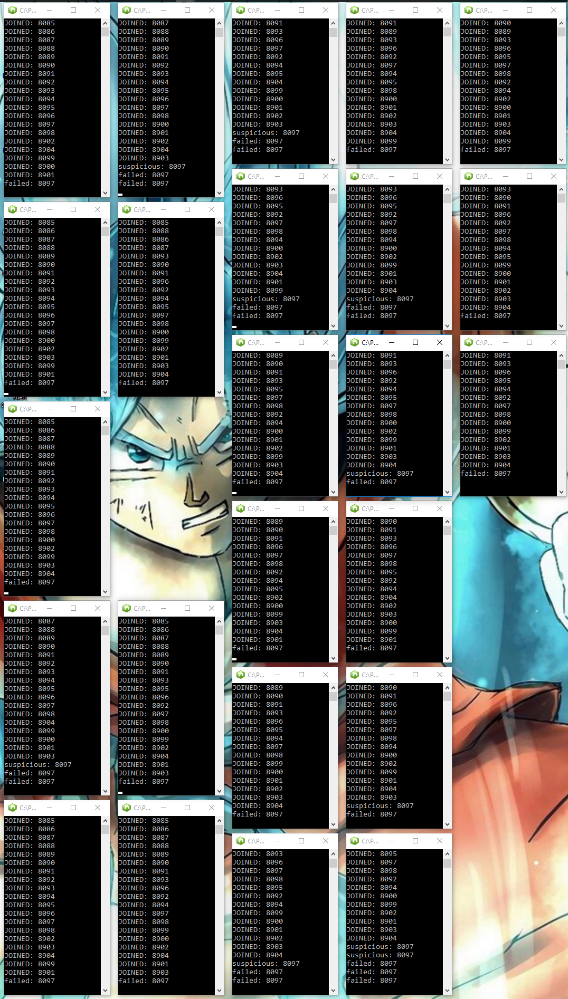

# dht-node
Did my course on distributed systems by Dr Indranil Gupta (UIUC) long back and have wanted to try out the principles explained in the course. We use distributed systems alot in our development pipelines but most of the concepts are abstracted out by the cloud solutions. I work for Azure, and we use concepts like scheduling, queuing, distributed caching all the time but most of these are provided as a SaaS offering. So I'm picking this up as a fun exercise to refresh the underlying concepts.


### A key-value store, or key-value database, is a data storage paradigm designed for storing, retrieving, and managing associative arrays, a data structure more commonly known today as a dictionary or hash. A distributed KV store is one where data is replicated across different nodes such that there is:
 - High Availability, and
 - No single point of failure

## Distributed Key Value Store
This will provide simple abstraction for CRUD operation on a key value pair. The operations will be exposed using simple rest calls like
````
POST http://localhost:8000/d/key -d "value"
GET http://localhost:8001/d/key
DELETE http://localhost:8002/d/key
````
I'll follow a cassandra like architecture where nodes maintain a virtual ring topology and location of key is retrieved based on hash function. Few things I'll follow:

 - Consistency type: Strong, Quorum based
 - Membership protocol: SWIM
 - No auth, No ssl
 - local clocks will be used, as they are already in sync with system clock.
 - The data will be stored in memory (in context of the process), no commit logs will be maintained; If all process die or some most die before replication data will be lost; 

## Setup and tests
Pre requisite
 - Download nodejs and npm for windows
 - Clone this repo: `git clone https://github.com/mebjas/dht-node.git`
 - CD to process dir: `cd process` - this path contain the code for process
 - Install the libraries - `npm install`
 - Run Tests - `npm test`
 - Initialize 24 nodes: `cd ..\ && .\init.cmd`

To run just `N` nodes skip the last step and manually invoke an instance using:
```cmd
node process\index.js <portno> <introducer>
```
`<portno>` - port number or this instance

`<introducer>` - port number of the introducer to which join request will be sent; Not needed for first instance - it will assume itself to be first instance because of this; I didn't go for any automatic discovery or centralized discovery mechanism here;

## Top level architecture
```
    ___________________________
    [ Rest + No Auth + No SSL ]
    ---------------------------
         _______________
         [ Application ]
         ---------------

___________   _______________   _________________
[ Storage ]   [ Replication ]   [ Stabalization ]
-----------   ---------------   -----------------
        _________________________
        [ Virtual Ring Topology ]
        -------------------------

        _______________________
        [ Membership Protocol ]
        -----------------------
```

## TASK 1.1: Membership Protocol
Implementing SWIM Protocol, where the membership gossips are piggibacked on PING, PING_REQ, JOINREQ, ACK responses. In a given protocol period a node will select a random node and send a ping. If it get's ACK well and good. It'd stay idle till completion of protocol period. If it doesn't get an ack, it'd send a ping request to K random nodes, and they will ping the target node. If any of then send an ack with in the target period the node is conisedered alive else it's moved to suspicions state; it no one confirms it's alive in time < 2 * protocol period - it's removed from the list;

These screenshots are when 8 nodes were joined and two of them crashed


Detecting failures in 24 nodes :D 


## TASK 1.2: Testing Membership Protocol

1. Simple unit testing using mocha framework for node js. It's pretty new to me but seems pretty powerful. I have done basic testing will do advanced ones later. Also since the library depends on HTTP calls some mocks / stubs shall be needed.
2. To Be Done is e2e testing of membership protocol<br>
        - create nodes<br>
        - JOIN nodes<br>
        - FAILURES & Failure detection<br>
        - Time to detection, accuracy of detection<br>
        - congestion / message drop emulation<br>
        - high load setup <br>

## TASK 2.1: Virtual ring topology
## TASK 2.2: Test Virtual ring topology
## TASK 3.1: Storage Replication & Stabalisation
## TASK 3.2: Test Storage Replication & Stabalisation

## TASK 4: Rest API + Test - final


